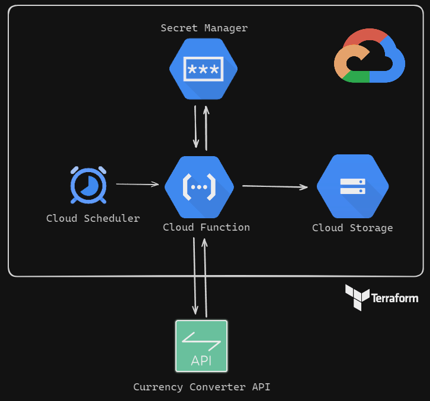

# Ingestão de Dados por API em ambiente Cloud (GCP) - Camada RAW

O objetivo deste projeto é desenvolver uma automação que colete dados relacionado as moedas por meio de uma API e armazene esses dados em uma camada raw, visando uma evolução para aspectos analíticos (será explorado nos futuros projetos). 

A API que iremos utilizar será a [Free Currency Conversion API](https://freecurrencyapi.com). Essa API é privada (ou seja, será necessário cadastro de uma conta), mas possui 5k requisições gratuitas por mês, envolvendo mais de 32 moedas e tendo atualização diária.

Devemos, diariamente, verificar o valor do REAL BRASILEIRO perante as outras 31 moedas mundiais. Vamos visar que nos futuros projetos desejamos ter uma área analítica para desenvolvimento de paínes para análises relacionados aos aspectos financeiros do Brasil. Por isso, precisamos inicialmente coletar esses dados e armazenar na camada RAW dentro de um Cloud Storage na nuvem da Google Cloud.

Será utilizado Cloud Functions como local de execução do código, que será desenvolvido em Python, seguindo os princípios da programação orientada a objetos (POO) e as melhores práticas de programação.

O gatilho de execução será configurado por meio do Cloud Scheduler. Toda a infraestrutura será provisionada utilizando o Terraform, que permite a criação da infraestrutura como código. 

## Tecnologias Utilizadas
- Python: Linguagem de programação utilizada para o desenvolvimento da pipeline.
- Cloud Functions: O ambiente na nuvem que executará o código Python, fornecendo escalabilidade e flexibilidade.
- Cloud Storage: Um ambiente na nuvem que permitirá armazenar os arquivos JSON, incluindo as respostas da API de forma segura e escalável.
- Cloud Scheduler: Uma ferramenta na nuvem que permite agendar a execução das Cloud Functions, possibilitando automação e programação de tarefas.
- Secret Manager: A ferramenta que irá auxiliar no armazenamento de dados sensíveis, como tokens.
- Terraform: Uma ferramenta que possibilita a provisionamento eficiente de toda a infraestrutura necessária, seguindo a metodologia de infraestrutura como código (IaC).

## Arquitetura

# Passos da Execução
## Inicio
Crie um repositório pessoal público com um ReadME inicial. Copie o tópico " Ingestão de Dados por API em ambiente Cloud (GCP) - Camada RAW", juntamente com a lista de tecnologias e desenho da arquitetura. Fique a vontade de fazer suas próprias adaptações.

## Preparação: Alguns questionamentos relevantes...
Agora se pergunte e tente responder esses questionamentos em torno da arquitetura escolhida e tecnologias selecionadas:
- Qual seria a necessidade da camada RAW no Cloud Storage? Por que não podemos simplesmente extrair, transformar os dados visando o que desejamos e já carregar em um banco de dados com estruturas de tabelas? Que ganhos teremos com isso e que problemas poderiamos ter?
- Por que utilizar Cloud Function? Que benefícios teriamos em vez de utilizar um Compute Engine ou um CloudRun?
- Qual seria a necessidade do uso do Secret Manager?
- Por que utilizar Terraform em vez de interagir com console ou utilizar múltiplas linhas de comando (com o Google CLI)?

Adicione essas explicações para as decisões de arquitetura e escopo ao seu ReadME.

Agora pense nesses aspectos que irão impactar na estrutura do projeto:
- Como seria o fluxo de consumo com API em uma execução da ingestão? Quais endpoints deveríamos interagir e em qual ordem?
    - Teste o consumo da API utilizando a ferramenta Postman. Documente esse fluxo de consumo e explicação em torno da origem na sua documentação do ReadME.

- Qual seria a frequência da ingestão de dados? Como isso seria definido no Cloud Scheduler?
- Como você organizaria as pastas dentro do bucket? Que formato de arquivo você utilizaria? Como seriam os nomes dos arquivos?
- Faria sentido alguma estratégia de ciclo de vida dos objetos dentro desse bucket?
- Por que criar uma conta de serviço para ser atrelado à Cloud Function?
- Que permissões seriam necessárias ser atribuídas à conta de serviço para escrita no Cloud Storage e acesso ao Secret Manager?
    - Documente em torno da frequência de ingestão, volumetria esperada, organização das pastas dentro do bucket e a estratégia de ciclo de vida dos objetos.

- Como você irá organizar as pastas com os códigos desse projeto?
- Como você estruturaria o projeto Python atrelado dentro da Cloud Function? Que módulos utilizaria?
- Faça o diagrama de classes do código Python atrelado à Cloud Function.

## Mão no código...
Depois de compreender o funcionamento da API, da arquitetura do projeto (inclusive o porquê das decisões que foram tomadas) e do escopo do projeto (organização das pastas, dependências e diagrama de classes), vamos colocar começar a desenvolver os códigos, seguindo essas etapas lógicas:
- Realizar a Requisição à API e fazer Testes (utilizando um Jupyter Notebook e Postman);
- Desenvolva via Terraform o bucket no Cloud Storage, o Cloud Scheduler e o Secret Manager (caso não seja aplicável, utiliza shell scripts iteragindo com a linha de comando gcloud);
- Desenvolva via Terraform a conta de serviço com as permissões necessárias;
- Desenvolvimento da Lógica de Armazenamento do Token da API e Consumo do Mesmo (utilizando POO);
- Desenvolvimento da Lógica de Requisição à API (utilizando POO);
- Desenvolvimento da Lógica de registro em bucket do Cloud Storage (utilizando POO);
- Provisionamento via Terraform da Cloud Function na Nuvem;
- Na Nuvem, realize o Teste provocando um gatilho manual ao Cloud Scheduler e visualize se o arquivo foi salvo corretamente no bucket, conforme lógica.

## Documente...
Após essas etapas, adicione ao ReadME do seu repositório uma breve descrição da estrutura de pastas do seu projeto, anexe o diagrama de classes atualizado (dentro da realidade do seu projeto), explique como ficou a estrutura do seu bucket no Cloud Storage e como os arquivos serão ingeridos.

## Divulgue e Compartilhe!
Compartilhe no Linkedin este projeto, colocando o link do seu repositório do GitHub. Fique à vontade para marcar o fundador da Apoena Stack (Iury Rosal) ou a página da Apoena Stack no Linkedin. Se você é aluno da Apoena Stack, não deixe de compartilhar o certificado atrelado a implementação desse projeto, submissão e correção pelo time da Apoena Stack.

# Indicação de Conteúdos
Aqui indicamos conteúdos internos da Apoena Stack e externos que podem auxiliar na sua trilha de construção desse projeto.

## Conteúdos da Plataforma da Apoena Stack
- [Cloud IAM no Google Cloud](https://apoenastack.ensinio.com/g/fundamentos-em-google-cloud-platform/classwork/dia-07-cloud-iam1/introducao-ao-cloud-iam)
- [Curso Agregando Valor com Baixo Custo](https://apoenastack.ensinio.com/g/agregando-valor-com-baixo-custo)
- [Curso Estruturação de Projetos Python](https://apoenastack.ensinio.com/g/estruturacao-de-projetos)
- [Curso Programação Orientada a Objetos](https://apoenastack.ensinio.com/g/poo-python)
- [Curso Aplicando Principios SOLID](https://apoenastack.ensinio.com/g/aplicando-principios-solid-em-projetos-de-dados)
- [Consumo de APIs via Python](https://apoenastack.ensinio.com/g/uso-construcao-e-boas-praticas-apis/classwork/dia-02-consumindo-apis-36min-10s/consumo-de-apis-via-python-parte-1)
- [Consumindo APIs Privadas](https://apoenastack.ensinio.com/g/uso-construcao-e-boas-praticas-apis/classwork/dia-03-apis-privadas-17min1/consumindo-apis-privadas)

## Conteúdos Externos
- [Deploy Cloud Functions on GCP with Terraform (1st Gen Environment)](https://medium.com/cloud-native-daily/deploy-cloud-functions-on-gcp-with-terraform-c6026be9d645)
- [How to periodically run your Google Cloud Function with Cloud Scheduler](https://medium.com/@steffenjanbrouwer/how-to-periodically-run-your-google-cloud-function-with-cloud-scheduler-11e7c79b1994)
- [How to Store Sensitive Data on GCP: Secret Manager](https://medium.com/google-developer-experts/how-to-store-sensitive-data-on-gcp-d96e4e545224)

## Documentações
- [FreecurrencyAPI Docs](https://freecurrencyapi.com/docs)
- [Postman](https://www.postman.com)
- [google_cloudfunctions_function](https://registry.terraform.io/providers/hashicorp/google/latest/docs/resources/cloudfunctions_function)

# Agenda do Projeto
| Data do Encontro | Tema |
| ----------------- | ------ |
| 17/10/2024 20h | Passo #1 - Discussão de Escopo e Output de Preparação |
| 29/10/2024 20h | Passo #2 - Exibição de Lógica até onde foi desenvolvido |
| 05/11/2024 20h | Passo #3 - Exibição Final do Projeto |
